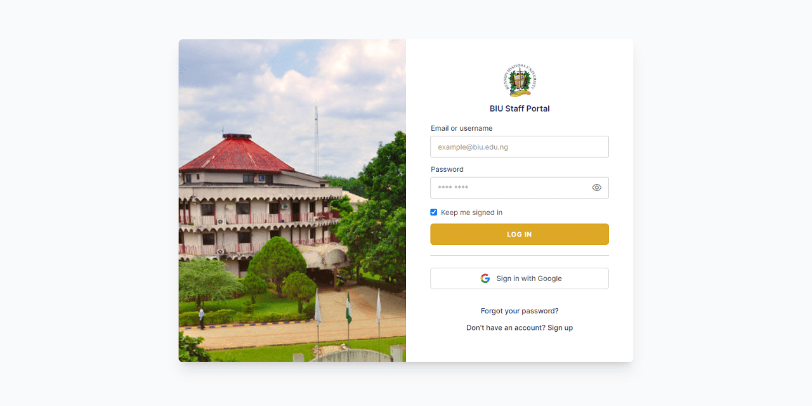

# BIU Portal

Admission Portal - Benson Idahosa University

[](https://laravel.com/docs/8.x)
[](https://www.w3schools.com/php/default.asp)
[](https://www.w3schools.com/mysql/default.asp)

## Installation

```
$ git clone https://github.com/2gbeh/biu-portal.git

$ cd biu-portal

$ composer install

$ php artisan serve
```

## Usage

> Starting Laravel development server: http://127.0.0.1:8000

## Documentation



